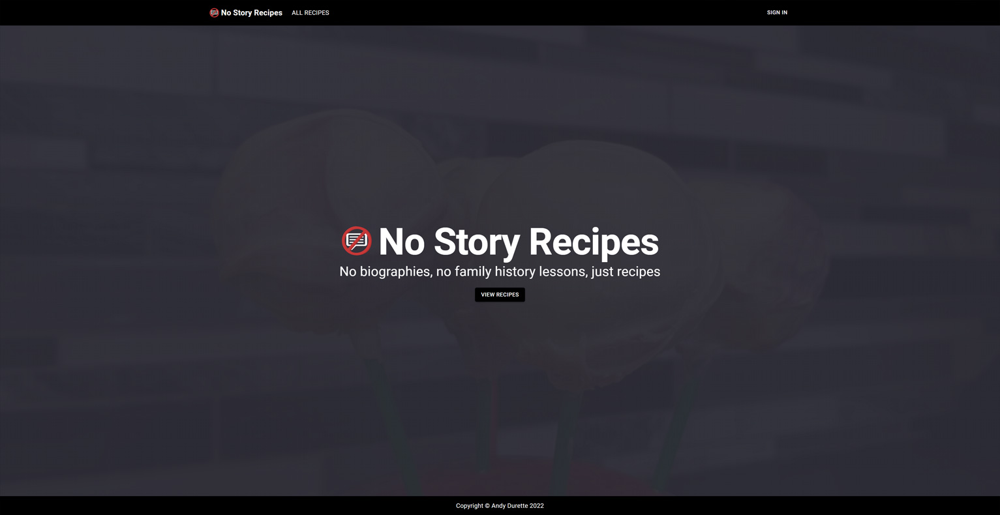

# React Section of AWS CDK No Story Recipes Site

I have always wanted to have my own personal recipe site where there isn't stories or talks of peoples lives just the recipes themselves simplified down for an amateur cook like myself.

So as a method of learning AWS CDK I decided to build it.

This is an ongoing build project where features are still being added.

Features, checkmarks are done, crosses are features yet to be added

- Authentication and Authorization, kept only to myself to avoid AWS costs. ✅
- Ability to create recipes inside the app via a GUI✅
- Ability to update recipes inside the app via a GUI ❌
- Add images to display with recipes from an S3 bucket. ✅
- Proper Integration of typescript into code ❌
- Adding tests for functionalities ❌

Live View: https://digsei298jthl.cloudfront.net/

This project was bootstrapped with [Create React App](https://github.com/facebook/create-react-app).

## Available Scripts

In the project directory, you can run:

### `npm start`

Runs the app in the development mode. 
Open [http://localhost:3000](http://localhost:3000) to view it in the browser.

The page will reload if you make edits. 
You will also see any lint errors in the console.

### `npm test`

Launches the test runner in the interactive watch mode. 
See the section about [running tests](https://facebook.github.io/create-react-app/docs/running-tests) for more information.

### `npm run build`

Builds the app for production to the `build` folder. 
It correctly bundles React in production mode and optimizes the build for the best performance.

The build is minified and the filenames include the hashes. 
Your app is ready to be deployed!

See the section about [deployment](https://facebook.github.io/create-react-app/docs/deployment) for more information.
